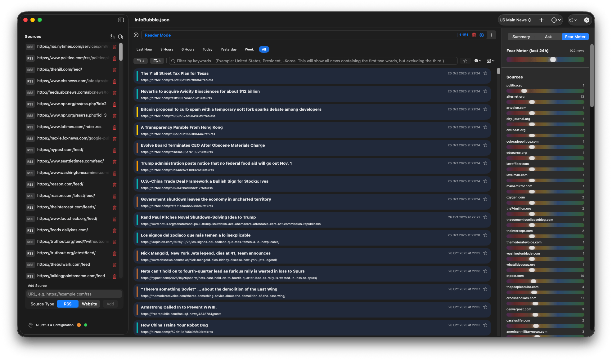

# InfoBubble app for MacOS | https://apps.apple.com/app/id6752404003

That is partially free app for MacOS what allows you to filter news from feed news by AI. 
In demo version it has limitations - 10 sources, 3 criterias, 2 workspaces.
Full version is one time pay in-app, with allowed family sharing.

The app's workflow is built on three simple elements:

1.  **Sources:** These are the news sites, blogs, or RSS feeds you want to monitor.

We are collecting an RSS channel list that is hidden under File → Import Sources. It’s not a global database, and it’s only loosely categorized by AI, but it’s a good starting point to test the app and later use your own sources.

If you are here to only get the sources list for your own purposes - its here:
[Download InfoBubble World RSS Database](Sources/all.sources.rss.yaml)

it will be periodically updated.

2.  **Criteria:** These are your instructions for the AI, written in natural language. Instead of just keywords, you describe the *idea* of what you're looking for (e.g., _"News about major scientific breakthroughs in AI"_).

3.  **Results:** These are the filtered news articles that match your criteria. From these, you can generate concise AI summaries.

## First Steps: Setting Up Your Workspace

When you first launch Newsmaker, a setup checklist at the top of the main window will guide you through the initial steps.

### Step 1: Configure the AI

Newsmaker requires a connection to a Large Language Model (AI) to analyze and summarize news. You have two options:

*   **Apple Intelligence (Not Recommended):** If your device supports it, this is the easiest and most private option, as all data is processed locally on your Mac. You can enable it in **Settings** → **Analysis** and **Settings → **Summaries**. However, in 2025, it is not recommended for complex analysis, because Apple’s AI model is currently small and lacks the contextual knowledge of global events. It simply does not have enough information. That said, it is still sufficient for summarization and translation in the supported languages

*   **External Service (OpenAI-Compatible, Recomended):** You can connect to any service that uses the OpenAI API format, including your own local AI server (like LM Studio, what is fully free). To do this, provide the server URL and model name in the settings. You need to increase context size for input, at least for 60k tokens.

    [How to use this app with local LLM, using LM Studio as example](Howto/LMStudio/LocalAI.md)

### Step 2: Add Sources
*   On the left sidebar, find the "Add Source" section.
*   Enter the URL of a website or RSS feed.
*   Select the source type (`Website` or `RSS`) and click "Add".
*   **Tip:** You can quickly import pre-made lists of sources via the **File → Import Sources** menu to get started faster.

### Step 3: Create Criteria
*   On the left sidebar, below the sources list, add at least one criterion.
*   Describe the topic you're interested in as specifically as possible. For example:
    *   _`Economic forecasts for the European real estate market`_

### Step 4: Save Your Project
Newsmaker keeps all your settings, sources, and criteria in a single project file. To avoid losing your setup, save your project via **File → Save As...**. The app will automatically reopen your last project file on subsequent launches.

## Start Processing

Once everything is configured, just click the **▶️ (Play)** button at the top of the center panel. Newsmaker will begin fetching and analyzing news.

*   The **main area** will display a list of articles that match your selected criterion.
*   Use the **filters** above the list to sort news by sentiment, source, or keywords.
*   An **AI-generated summary** of the latest news will appear at the bottom. Click it to expand and read the full text.

That's all you need to know to get started. Experiment with different sources and criteria to build the perfect news feed for your needs!

***

If you have any questions or run into issues, please don't hesitate to contact, using issues here.

